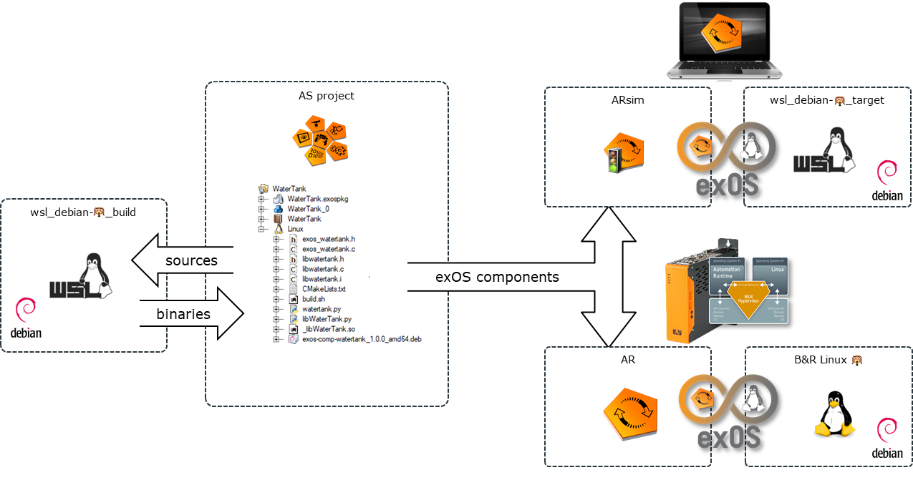
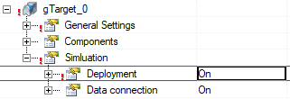
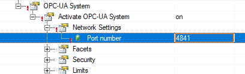

# exOS-WSL
WSL images for exOS build environment and ARsim deployment target system

exOS works best with WSL as a build environment for the components that are to be deployed on a Linux target system, as WSL executes a full-fledged Linux in the background containing all needed packages for the exOS components to be compiled. With the exOS Technology Package, the background WSL compile step can be integrated into the Automation Studio project build, which ensures that components are compiled and deployed to AR and Linux in a consistent manner.

B&R offers a Debian-based distribution for the B&R Hypervisor system

- `B&R Linux 9` - based on Debian stretch
- `B&R Linux 10` - based on Debian buster

In order to keep all packages used within exOS components compatible between the target and the build environment, its strongly recommended to use the same version (stretch, buster) on both systems. For example, for a `B&R Linux 10` target system, a `Debian buster WSL` build environment should be used.

These "naked" debian images (obtained from [Docker Hub](https://hub.docker.com/_/debian)) are available in the [WSL-images/naked](WSL-images/naked) folder. These provide a minimal set of debian packages for a certain version.

## Preinstalled WSL images

> The following information and provided images require [WSL2](https://docs.microsoft.com/en-us/windows/wsl/install) as a base subsystem.

### Build environment

The exOS Technology Package offers installers for the exOS-specific build infrastructure that can be executed inside WSL of "naked" images, described in a chapter in the exOS help. In order to simplify this installation, a ready-made build environment (`wsl_debian-{ver}_build`) is available via this repository.

### Deployment target

Furthermore, a WSL-based target system with a preinstalled exos-server (`wsl_debian-{ver}_target`) is available, which can be used in together with ARsim, to run the complete exOS project in a simulated environment. For "naked" images, the exOS help contains chapters on how to install systemd via systemd-genie and the exos-server.

### Topology

---

### Download

The images are based on a certain version of debian, for example `10` for `buster`.

The images have the exOS library/server installed for a certain Technology Package version, and are thus versioned accordingly. 

The link refers to the latest version aviable, older versions are found in the [WSL-images](WSL-images) folder.

- [`wsl_debian-10_build_2.0.0.tar`](https://github.com/br-automation-com/exOS-WSL/raw/main/WSL-images/wsl_debian-10_build_2.0.0.tar) 

    WSL Build environment for with the exOS API library for building sources

    - exos-data-eth
    
    Additional packages (obtained via apt):

    - cmake
    - curl
    - build-essential
    - libzmq3-dev
    - python-dev
    - python3-dev
    - nodejs
    - npm
    - swig

- [`wsl_debian-10_target_2.1.0.tar`](https://github.com/br-automation-com/exOS-WSL/raw/main/WSL-images/wsl_debian-10_target_2.1.0.tar)

    WSL target environment with the exOS OPCUA deployment server

    - exos-server

    Additional packages (obtained via apt)

    - ufw (disabled)
    - python-dev
    - python3-dev
    - nodejs
    - systemd-genie
    - aspnetcore-runtime-6.0
    - apt-transport-https
    - wget

---

### Installation

The images are imported into WSL using the `--import` command. Here a destination for the Linux filesystem also needs to be supplied, and as the WSL images can be seen as an additional part to the exOS Technology package, it makes sense to create a `WSL` folder inside the `BrAutomation` folder and place the Linux filesystems there. 

    cd C:\BrAutomation
    mkdir WSL

#### Build environment

The name of the build enviroment should be `Debian` as the default exospkg will call `wsl -d Debian` when executing the `<BuildCommand>` as part of the Automation Studio build process.

The preinstalled WSL-build image for Debian 10 / TP 2.0.0 is imported as follows:

    wsl --import Debian C:\BrAutomation\WSL\DebianBuild .\wsl_debian-10_build_2.0.0.tar

As this enviroment is most likely to be used in conjunction with VsCode Remote, or in order to debug, test or build sources manually, it is recommended to set the "Debian" instance as the default WSL distribution, so that the "open Linux shell here" context menu, or the plain "wsl" command in a terminal window will open the Debian 10 build instance.

    wsl --setdefault Debian

#### Deployment target

To use the deployment target WSL image for ARsim, Deployment needs to be switched `On` in the *exostarget* configuration.

> When starting deployment target WSL-image, the exos-server will open the OPCUA port 4840 on the localhost (127.0.0.1). It is therefore important, that when this is used together with ARSim, the OPCUA server of Automation Runtime is set to an alternative port, for example 4841. This setting is found in the CPU->Configuration in the Physical view.
>
> 

The name of the image is not important to have a certain name like the build environment, as it should preferrably be managed completely via exOS. 

The preinstalled WSL-target image for Debian 10 / TP 2.0.0 is imported as follows:

    wsl --import DebianTarget C:\BrAutomation\WSL\DebianTarget .\wsl_debian-10_target_2.0.0.tar

The WSL deployment target is started as a tab within the [Windows Terminal](https://docs.microsoft.com/en-us/windows/terminal/install) or via the command 

    wsl -d DebianTarget

The deployment server needs root access, so the sudo password needs to be entered when starting up. It is displayed in the console. 

---

### Uninstall

When shifting to a new version of the build/target image, it makes sense to remove the previous instances. This is done via first unregistering the WSL images

    wsl --unregister Debian
    wsl --unregister DebianTarget

Then removing the Linux filesystems inside the `BrAutomation` folder (Powershell):

    rm C:\BrAutomation\WSL\DebianBuild
    rm C:\BrAutomation\WSL\DebianTarget

After that, the new images can be installed.
